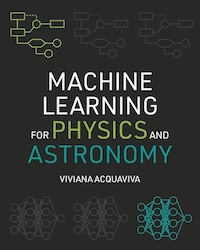

# ML for Astronomy

I took ML for Astronomy in Summer 2025 with Professor [Ana-Maria Delgado](https://itc.cfa.harvard.edu/people/ana-maria-delgado) at Harvard. It was a wonderful introduction to ML through the lens of astronomy.

I've compiled the lectures, which were a combination of [astronomy](#astronomy-lectures) and [ML](#ml-lectures) as well as the [in-class notebooks](#in-class-notebooks) and [homeworks](#homeworks).

The textboook was [Machine Learning for Physics and Astronomy](https://www.amazon.com/Machine-Learning-Physics-Astronomy-Acquaviva/dp/0691206414/).

There's a myriad of ML learning resources on-line - I found the first few videos from Dr. Andrew Ng's [class](https://www.youtube.com/watch?v=jGwO_UgTS7I&list=PLoROMvodv4rMiGQp3WXShtMGgzqpfVfbU) very helpful preparation.

### Astronomy Lectures
These six lectures build a bottom-up picture of modern astronomy. They start with the Solar System and the shift from geocentric ideas to a physics-based universe through Copernicus, Galileo, Kepler’s laws, and Newtonian gravity, plus the distance units astronomers use. They then develop the cosmic distance ladder: stellar classification and the H–R diagram, geometric parallax, and standard candles such as Cepheids (via Leavitt’s period–luminosity law) and Type Ia supernovae, culminating in Hubble’s law and cosmic expansion. The course broadens to cosmology—homogeneity/isotropy, curvature, redshift, scale factor, and key parameters like $H_0$ and the dark energy/dark matter budget—then to exoplanet discovery methods and habitability, and finally to galaxy–halo modeling (HOD) and ML with simulations to connect galaxies to dark matter and large-scale structure.

#### Solar System
This [lecture](Lecture_Slides/Astronomy_Slides/Lecture_1_SolarSystem.pdf) introduces the Solar System’s structure (planets, moons, asteroid belt, Kuiper Belt, and Oort Cloud as a source of long-period comets), then gives a quick history of astronomy from geocentric to heliocentric ideas. It explains Kepler’s three laws, Newton’s laws of motion and gravitation, and basic angular/distance units (arcseconds, light-years, parsecs).

#### Distance Ladder
This [lecture](Lecture_Slides/Astronomy_Slides/Lecture_2_Distance_Ladder.pdf) explains the “cosmic distance ladder”: how astronomers infer distances from nearby to very distant objects. It reviews stellar classification and the HR diagram, then introduces flux vs luminosity and the magnitude system. It covers parallax/triangulation and the parsec, and shows how Type Ia supernovae act as standard candles for large distances.

#### Cosmological Parameters
This [lecture](Lecture_Slides/Astronomy_Slides/Lecture_3_CosmologicalParameters.pdf) introduces key cosmological parameters under the Cosmological Principle (homogeneous, isotropic) and a flat (Euclidean) universe. It motivates dark matter via cluster and galaxy dynamics (Zwicky’s Coma cluster; Rubin/Ford rotation curves), then summarizes the universe’s energy budget (matter vs dark energy) and how densities scale with redshift/scale factor. It defines the Hubble constant $H_0$, noting Hubble’s law is only a crude nearby-distance tool.

#### Distance Ladder, continued
This [lecture](Lecture_Slides/Astronomy_Slides/Lecture_4_DistanceLadder_Coninued.pdf) continues the cosmic distance ladder, highlighting Henrietta Swan Leavitt’s discovery of the Leavitt Law—the period-luminosity relation for Cepheid variable stars. These "standard candles" enabled Edwin Hubble to measure galactic distances, leading to the discovery of the universe's expansion via Hubble’s Law.

#### Exoplanets
This [lecture](Lecture_Slides/Astronomy_Slides/Lecture_5_Exoplanets.pdf) surveys exoplanet detection: transits (dips in starlight → planet size, period, semi-major axis), radial velocity (Doppler shifts → planet mass and orbit), plus astrometry, gravitational microlensing, and direct imaging (with coronagraphs/starshades). It ends with the habitable zone concept (liquid water; ~273–373 K) and factors affecting habitability (star/planet properties, atmosphere).

#### Galaxy-Halo Connection
This [lecture](Lecture_Slides/Astronomy_Slides/Lecture_6_GalaxyHaloConnection.pdf) explores the galaxy-halo connection, explaining how galaxies act as biased tracers of the universe's dark matter structure. It details the Halo Occupation Distribution (HOD) and demonstrates using machine learning with IllustrisTNG simulations to improve modeling beyond standard mass-only approaches. Additionally, it reviews the universe's composition and Large-Scale Structure history.

---

### ML Lectures
These eight lectures give a practical intro to machine learning from foundations to modern models. You start with what ML is, how supervised vs unsupervised learning differ, and why train/test splits matter for generalization. You study core algorithms—decision trees (impurity-based splitting), kNN (distance-based prediction), SVMs (max-margin classifiers with kernels), and regression (R²/MSE, polynomial/logistic ideas). You learn how to evaluate models correctly using precision/recall, ROC–AUC, and k-fold cross-validation, plus bias–variance diagnostics with learning curves. The course then expands to ensembles (bagging vs boosting, Random Forests and XGBoost, feature importance), unsupervised methods (k-means, hierarchical clustering, PCA/kernel PCA), and neural networks, from perceptrons/MLPs to CNNs, RNNs, autoencoders, and GANs.

#### Introduction to ML
This [lecture](Lecture_Slides/Textbook_Slides/1_IntroML.pptx) introduces machine learning as teaching machines to make decisions (a toolbox, not magic). It contrasts ML with traditional inference, defines key jargon (features, labels/targets, instances), and explains supervised vs unsupervised learning plus regression vs classification. It highlights astrophysics uses (scaling classification, emulators, model-free inference, dimensionality reduction/domain shift) and stresses train/test splits and representative data.

#### Decision Trees and K-Nearest Neighbors
This [lecture](Lecture_Slides/Astronomy_Slides/2_Intro_DT_kNN.pptx) explores Decision Trees and K-Nearest Neighbors (KNN). It details how Decision Trees use binary splits to minimize Gini impurity, while KNN determines outcomes based on the "k" closest training neighbors. Discussions include parameter tuning, distance weighting, and the significant impact of train/test splits on model performance.

#### Metrics and Cross-Validation
This [lecture](Lecture_Slides/Astronomy_Slides/3_Metrics_CV_Diagnostics.pptx) covers how to evaluate and debug ML models beyond raw accuracy. It explains the “accuracy paradox” for imbalanced classes, introduces confusion-matrix terms (TP/TN/FP/FN) and metrics like precision, recall, F1, plus ROC curves and AUC. It then motivates k-fold cross-validation and shows bias–variance diagnostics, learning curves, and common fixes for under/overfitting.

#### Support Vector Machines
This [lecture](Lecture_Slides/Astronomy_Slides/4_SVM_OptimizingHParams_NestedCV.pptx) explores Support Vector Machines, focusing on maximizing the margin between classes using optimal hyperplanes. It details regularization for noisy data, the kernel trick for non-linearities, and hyperparameter optimization. Finally, it introduces nested cross-validation for reliable generalization error.

#### Regression
This [lecture](Lecture_Slides/Astronomy_Slides/5_Regression.pptx) introduces regression (continuous targets) and why classification metrics don’t apply. It covers regression evaluation: correlation ideas, R² (and why it can be negative on test data), plus MSE/RMSE/MAE. It then teaches linear regression via OLS/normal equation vs gradient descent (batch/SGD/mini-batch), regularization (ridge), and extensions like logistic and polynomial regression.

#### Bagging and Boosting
This [lecture](Lecture_Slides/Astronomy_Slides/6_Bagging_Boosting_FeatImp.pptx) explains ensemble learning with bagging vs boosting. Bagging (e.g., Random Forests/Extra Trees) builds many randomized trees in parallel and averages/votes to reduce variance; boosting (AdaBoost/GBTs/XGBoost) adds learners sequentially to fix prior errors, often reducing bias but risking overfit (needs regularization like learning rate, subsampling). It closes with feature importance (MDI/MDA), plus pitfalls (high-cardinality bias, overfitting, correlated features) and alternatives like permutation importance/SHAP.

#### Clustering
This [lecture](Lecture_Slides/Astronomy_Slides/7_Clustering_dr.pptx) introduces unsupervised learning, focusing on clustering and dimensionality reduction. It contrasts partitional methods like k-means with hierarchical clustering, which uses dendrograms to organize nested groups. Additionally, it explores Principal Component Analysis (PCA) and Kernel PCA for dimensionality reduction, detailing how to evaluate information loss and capture data variability.

#### Neural Networks
This [lecture](Lecture_Slides/Astronomy_Slides/8_IntroNN.pptx) gives a gentle intro to neural networks: from linear models to perceptrons and multi-layer perceptrons, emphasizing why nonlinear activations matter (e.g., XOR). It explains training with loss functions, gradient descent, and backprop/AutoDiff. It overviews practical improvements (initialization, optimizers like Adam, regularization/dropout) and briefly surveys CNNs, RNNs, autoencoders, and GANs.

---

### In-class Notebooks
These notebooks accompany the lectures and build a practical ML workflow for astronomy. You start with Python/NumPy/Matplotlib basics, then move to visualizing astronomical data and handling measurement error (parallax–distance). Next you fit simple models to data, including numerical integration tools, then apply scikit-learn linear regression with validation and residual analysis. You finish by training and evaluating decision-tree classifiers on real datasets.

#### Python Tutorial
This [notebook](In-Class_Notebooks/Class1_Python_Tutorial.ipynb) is a Python refresher for an astronomy machine-learning course. It introduces notebooks, basic syntax and data types (ints, floats, strings, booleans), arithmetic/operators, variables, and simple control flow. It then practices importing packages, core containers (lists/tuples/sets), functions and data visualization through NumPy and Matplotlib.

#### Visualizing Data and More
This [notebook](In-Class_Notebooks/Class2_VisualizingDataAndMore.ipynb) explores data visualization in astronomy using Matplotlib and NumPy. It guides users through calculating stellar distances from parallaxes, generating mock datasets with associated errors, and creating plots with shaded error regions to illustrate the inverse relationship between parallax and distance.

#### Fitting Models to Data
This [notebook](In-Class_Notebooks/Class3_FittingModelsToData.ipynb) focuses on fitting models to data, explaining how to choose between linear and curved models based on data shape and physical principles. It demonstrates creating toy data and implementing standard linear models. Additionally, it covers advanced techniques like vectorizing integrals using SciPy to perform efficient numerical calculations.

#### Linear Regression
This [notebook](In-Class_Notebooks/Class4_LinearRegression.ipynb) introduces linear regression with scikit-learn: importing tools, fitting a line to a dataset, and evaluating with R². It then treats it as an ML task: train/test split, k-fold cross-validation, mean/std of scores, and residual plots. Exercises include writing a cross-val helper and fitting Cepheid period–luminosity data.

#### Decision Tree Classifier
This [notebook](In-Class_Notebooks/class5_DecisionTreeClassifier.ipynb) introduces Decision Tree classification using scikit-learn. It guides users through the machine learning pipeline: data exploration, visualization, and train-test splitting. Practical exercises involve applying these steps to the digits dataset, followed by model fitting and performance evaluation to interpret results.

#### Random Forests
This [notebook](In-Class_Notebooks/class6_randomforests.ipynb) explores Random Forest Classifiers and Regressors. It demonstrates model implementation and utilizes feature importance plots to identify and rank key predictors. Additionally, it includes a discussion on addressing imbalanced data in regression tasks where standard stratification methods are unavailable.

<!-- was not in lectures, but was given the solution -->
#### kMeans
This [notebook](In-Class_Notebooks_Solutions/Class7_kMeans_Solutions.ipynb) explores k-means clustering, an unsupervised machine learning method used to group unlabeled data. It demonstrates how the algorithm identifies clusters in digit datasets, effectively recognizing numerical patterns without external guidance. The file provides practical solutions and references for mastering clustering applications.

---

### Homework

Data files are linked [here](Homework_Notebooks). Solutions are linked [here](Homework_Notebooks/Homework_Solutions/).

#### HW1: Introduction to Python
This [notebook](Homework_Notebooks/Notebook1_IntroToPython.ipynb) is an introductory Python assignment. It practices NumPy array creation/reshaping and basic scripting (indexing, checks, loops/conditionals). Students write a function to compute escape velocity from mass and radius, explore how escape velocity changes with radius, and plot the relationship with Matplotlib. It ends with a code-reading/commenting exercise on subplots.

#### HW2: Visualizing Data
This [notebook](Homework_Notebooks/Notebook2_VisualizingData.ipynb) explores data visualization in astronomy using Matplotlib and NumPy. It guides users through calculating stellar distances from parallaxes, generating mock datasets with associated errors, and creating plots with shaded error regions to illustrate the inverse relationship between parallax and distance.

#### HW3: Cosmological Parameters
This [notebook](Homework_Notebooks/Notebook3_CosmologicalParameters.ipynb) guides users through estimating cosmological parameters, specifically the matter density ($Ω_m$) and Hubble constant ($H_0$), using supernovae data. It emphasizes statistical evaluation through $χ^2$ scores, model comparison, and visualization of best-fit models against observational data to understand the universe's expansion rate and composition.

#### HW4: Decision Tree Classifiers and Habitable Planets
This [notebook](Homework_Notebooks/Notebook4_DecisionTreeClassifier_HabitablePlanets.ipynb) applies Decision Tree Classifiers to identify habitable exoplanets using data from the Planet Habitability Lab. It covers data preprocessing, model implementation, and evaluation. A central focus is analyzing learning curves to diagnose high bias or high variance and determine if the model requires more training data.

#### HW5: Random Forests and the Galaxy-Halo Connection
These three notebooks ([1](Homework_Notebooks/Notebook5_RandomForest_GalaxyHaloConnection_Group_1.ipynb), [2](Homework_Notebooks/Notebook5_RandomForest_GalaxyHaloConnection_Group_2.ipynb), [3](Homework_Notebooks/Notebook5_RandomForest_GalaxyHaloConnection_Group_3.ipynb)) implement Random Forest models to investigate the galaxy-halo connection. Using IllustrisTNG simulation data, it guides users through training and evaluating models based on physical features like mass and environment. The analysis emphasizes using the `evaluate_spread()` function and mass-binning to determine how specific features improve predictions of galaxy properties within dark matter halos.
